# 시스템 아키텍처
이 구조의 핵심은 쓰기(Command)는 MySQL 샤드에 집중하고, 조회(Query)는 고속 검색 엔진에서 수행하여 동기화 지연을 허용하는 최종 일관성(Eventual Consistency) 모델

1. Transaction (Source)
- 행동: 사용자가 ProductService.saveProductComposite()를 호출합니다.
- 결과: 샤딩 전략에 따라 ds-0, ds-1, ds-2 중 하나의 MySQL에 데이터가 INSERT/UPDATE 됩니다.
- 핵심: 애플리케이션은 오직 DB에만 집중합니다. Kafka에 메시지를 보내는 코드는 단 한 줄도 없습니다. (Dual Write 문제 해결)

2. Binlog Recording (MySQL)
- 행동: MySQL은 커밋된 트랜잭션을 Binary Log (Binlog) 파일에 순차적으로 기록합니다.
- 핵심: 이 Binlog가 바로 "진실의 원천(Source of Truth)"이자 변경 이력서입니다.


3. Capture & Stream (Debezium)
- 행동: Debezium 커넥터(inventory-connector-X)는 MySQL에 **"노예 서버(Slave replica)"**인 척 위장하고 접속합니다.
- 과정: MySQL은 "새로운 슬레이브가 왔네?" 하고 Binlog 스트림을 Debezium에게 쏴줍니다.
- 변환: Debezium은 이 바이너리 데이터를 해석해서 JSON 포맷(before, after 구조)으로 바꾼 뒤, 지정된 Kafka Topic(shard0...)으로 쏘아 보냅니다.
- 현재 상태: 여기까지 완료되었습니다! Kafka에 데이터가 쌓여 있습니다.

4. Consume & Indexing
- 행동: Spring Boot Consumer가 Kafka 토픽 3개를 구독(shard*.products)합니다.
- 로직: 메시지가 오면 after 데이터를 꺼내서 Elasticsearch에 upsert(없으면 입력, 있으면 수정) 합니다.
- 결과: 사용자는 "상품명 검색" 요청을 MySQL이 아닌 Elasticsearch로 날려서, 샤드 상관없이 0.1초 만에 결과를 얻습니다.

💡 왜 이 구조를 썼는가?
- 결합도 제거 (Decoupling): 비즈니스 로직에 kafkaTemplate.send()가 섞여 있으면, Kafka 장애 시 트랜잭션 롤백 여부가 애매해집니다. 이 구조는 DB 트랜잭션과 메시지 발행을 완벽히 분리합니다.
- 데이터 유실 제로 (Zero Data Loss): 애플리케이션 레벨에서 이벤트를 쏘다가 서버가 죽으면 이벤트가 유실될 수 있습니다. 하지만 Binlog는 DB가 커밋했다면 무조건 존재하므로, Debezium이 언제든 다시 읽어서 복구할 수 있습니다.
- 최종 일관성 (Eventual Consistency): 샤딩된 DB 환경에서 "전체 조회(Global Query)"는 불가능에 가깝습니다. 약간의 딜레이(수백 ms)를 감수하고 조회 전용 DB(Elasticsearch)를 구축하는 것이 대규모 시스템의 정석입니다.


🔄 데이터 흐름 상세 설명
1. Command Phase (쓰기 요청)
- 주체: 사용자 -> Spring Boot (API Server)
- 동작: ProductService.saveProductComposite() 호출.
- 로직: 애플리케이션 내부의 AbstractRoutingDataSource가 카테고리(Sharding Key)를 분석하여 ds-0, ds-1, ds-2 중 하나로 트랜잭션을 라우팅합니다.
- 특징: 이 단계에서는 Kafka나 Elasticsearch를 전혀 신경 쓰지 않습니다. 오직 DB 저장 성공 여부만 중요합니다.

2. CDC Phase (변경 감지)
- 주체: MySQL Binlog -> Debezium Connector
- 동작: DB에 INSERT/UPDATE/DELETE가 커밋되는 즉시, Debezium이 Binlog를 읽어 JSON 이벤트로 변환합니다.
- 특징: 애플리케이션 부하 없이 비동기로 작동하며, Delete Tombstone(삭제 마킹) 처리도 여기서 수행됩니다.

3. Streaming Phase (이벤트 전송)
- 주체: Debezium -> Kafka Topics
- 동작: shard0..., shard1... 등의 토픽으로 데이터가 발행됩니다.
- 특징: 순서 보장(Ordering)을 위해 파티셔닝 전략이 중요하며, 데이터가 유실되지 않는 버퍼 역할을 합니다.

4. Indexing Phase (동기화)
- 주체: Kafka -> Spring Boot Consumer -> Elasticsearch
- 동작: ProductSyncConsumer가 메시지를 수신합니다.
- op='c', 'u': Elasticsearch에 index(저장/수정) 요청.
- op='d': Elasticsearch에 delete 요청.
- payload=null: 툼스톤 메시지는 무시(Skip).

5. Query Phase (읽기 요청 - Next Step)
-  주체: 사용자 -> Elasticsearch
- 동작: "맥북"을 검색하면 샤딩된 DB 3개를 뒤지는 게 아니라, 단 하나의 Elasticsearch 인덱스를 조회하여 0.1초 안에 결과를 반환합니다.

# Debezium을 이용한 실시간 CDC(Change Data Capture) 구축 가이드
- Debezium은 MySQL의 Binlog를 읽어서 작동합니다. 현재 실행 중인 MySQL 컨테이너들이 Binlog를 ROW 포맷으로 기록하도록 설정해야 합니다.
- initdb/setup.sql 또는 각 DB에 접속하여 실행: CDC 전용 계정을 생성하고 권한을 부여합니다.


# Debezium 설정
Debezium(Kafka Connect)은 기본적으로 메시지에 **데이터의 스키마 정보(Schema)**를 포함해서 보냅니다.
- value.converter.schemas.enable=true (기본값)
```json
{
  "schema": { ... },   // 스키마 정보 (필드 타입 등)
  "payload": {         // 실제 데이터
    "before": { ... },
    "after": { ... },
    "source": { ... },
    "op": "c"
  }
}
```

- value.converter.schemas.enable=false (실무 권장)
```json
{
  "before": { ... },
  "after": { ... },
  "source": { ... },
  "op": "c"
}
```

- SMT (구조 변경 옵션) 사용 여부
만약 Debezium 커넥터 설정에 ExtractNewRecordState 같은 SMT를 적용했다면, 복잡한 before, op, source를 다 날리고 순수하게 after 데이터만 평평하게(Flatten) 보냅니다.


# docker 실행 후 샤드 등록
- mysql 컨테이너마다 등록해주어야함
- database.hostname, database.server.id, topic.prefix, schema.history.internal.kafka.topic 가 달라야함

1번 샤드
```http request
curl -i -X POST -H "Accept:application/json" -H "Content-Type:application/json" localhost:8083/connectors/ -d '{
  "name": "inventory-connector-0",
  "config": {
    "connector.class": "io.debezium.connector.mysql.MySqlConnector",
    "tasks.max": "1",
    "database.hostname": "mysql-3308", 
    "database.port": "3306",
    "database.user": "debezium",
    "database.password": "dbz",
    "database.server.id": "5001",
    "topic.prefix": "shard0",
    "database.include.list": "products",
    "schema.history.internal.kafka.bootstrap.servers": "kafka:29092",
    "schema.history.internal.kafka.topic": "schemahistory.shard0",
    "database.connectionTimeZone": "Asia/Seoul"
  }
}'
```


2번 샤드
```http request
curl -i -X POST -H "Accept:application/json" -H "Content-Type:application/json" localhost:8083/connectors/ -d '{
  "name": "inventory-connector-1",
  "config": {
    "connector.class": "io.debezium.connector.mysql.MySqlConnector",
    "tasks.max": "1",
    "database.hostname": "mysql-3309", 
    "database.port": "3306",
    "database.user": "debezium",
    "database.password": "dbz",
    "database.server.id": "5002",
    "topic.prefix": "shard1",
    "database.include.list": "products",
    "schema.history.internal.kafka.bootstrap.servers": "kafka:29092",
    "schema.history.internal.kafka.topic": "schemahistory.shard1",
    "database.connectionTimeZone": "Asia/Seoul"
  }
}'
```


3번 샤드
```http request
curl -i -X POST -H "Accept:application/json" -H "Content-Type:application/json" localhost:8083/connectors/ -d '{
  "name": "inventory-connector-2",
  "config": {
    "connector.class": "io.debezium.connector.mysql.MySqlConnector",
    "tasks.max": "1",
    "database.hostname": "mysql-3310", 
    "database.port": "3306",
    "database.user": "debezium",
    "database.password": "dbz",
    "database.server.id": "5003",
    "topic.prefix": "shard2",
    "database.include.list": "products",
    "schema.history.internal.kafka.bootstrap.servers": "kafka:29092",
    "schema.history.internal.kafka.topic": "schemahistory.shard2",
    "database.connectionTimeZone": "Asia/Seoul"
  }
}'
```

# 커넥터 상태 확인(3개 모두 RUNNING이어야 함)
```http request
curl -s "localhost:8083/connectors?expand=status"
```

# 기존 커넥터 삭제
```http request
curl -X DELETE localhost:8083/connectors/inventory-connector-0
curl -X DELETE localhost:8083/connectors/inventory-connector-1
curl -X DELETE localhost:8083/connectors/inventory-connector-2
```


# Kafka 토픽 생성 확인
```http request
docker exec -it docker-kafka-1 kafka-topics --list --bootstrap-server localhost:9092
```

